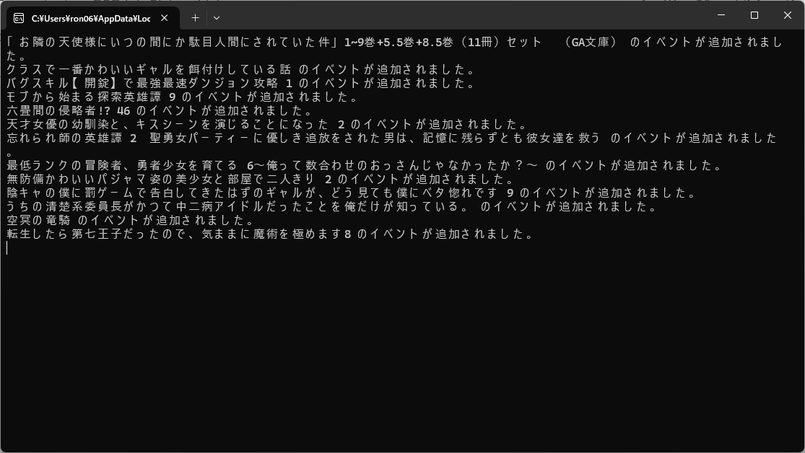
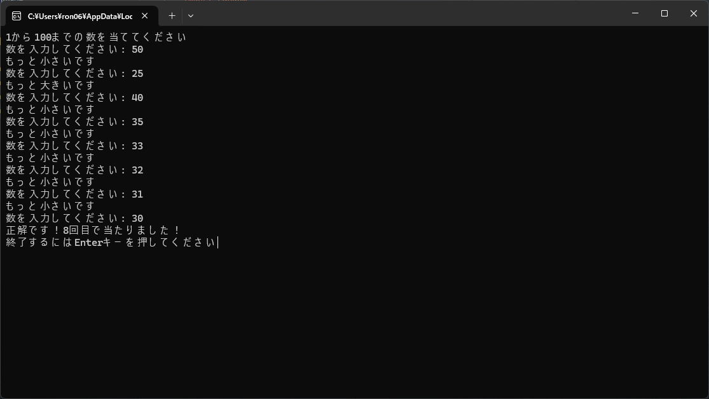

# Shirafuka_Practice

## Explanation

これは白深やよいが練習で作ったプログラムを置いておく場所です。  
PythonやNode.jsを使っているので、そのプログラムを置いておきます。  
自分が少しずつ覚えながら作っているコードなので、コメントが沢山ありますが注意してください。  
**chenge log:**

- docsの追加
- RUSTの追加

## Links

- Twitter [@shirafukayayoi](https://x.com/shirafukayayoi)

## Shirafuka_Programs

## Node.js

### Node_fb2kRichPresence.js

`Add 2024/06/11`  
foobar2000とYoutubeSourceを組み合わせて、DiscordRichPresenceに再生バーと動画のURLボタンを付けるやつ。  
実行結果はこんな感じ。  
  
詳しくはこのレポジトリを見てください。  
[https://github.com/shirafukayayoi/Node_fb2kRichPresence](https://github.com/shirafukayayoi/Node_fb2kRichPresence)

### PuppeteerDocs.js

`Add 2024/07/21`  
Puppeteerの基本的な使い方をまとめたNode.js。  
詳しくはコード内のコメントを見てください。

## Python

### AutoFolderUnzip.py

`Add 2024/07/17`  
フォルダ内のzipファイルを解凍するPython。  
詳しくはこのレポジトリを見てください。  
[https://github.com/shirafukayayoi/AutoFolderUnzip](https://github.com/shirafukayayoi/AutoFolderUnzip)

### Base64Decode.py

`Add 2024/10/26`  
Base64でデコードされた文字列と、元の文字列を使って複合キーを取得するPython

### BOOK-WALKER_NewBookCalendarPush.py

`Add 2024/11/10`  
[BOOK☆WALKER](https://bookwalker.jp/top/)の新刊情報のURLからタイトル等を取得しGoogleカレンダーに追加するPython。

### BOOK-WALKER_Sale_Information.py

`Add 2024/08/02`  
BOOK-WALKERのセール情報を取得するPython。  
Googleスプレットシートに出力されます。

```csv
タイトル,著者,価格,レーベル,終了日
```

詳しくはこのレポジトリを見てください。  
[https://github.com/shirafukayayoi/BOOK-WALKER_Sale_Information](https://github.com/shirafukayayoi/BOOK-WALKER_Sale_Information)

**chenge log:**  
`2024/08/02`:金額を数値として取得できるようにした。

### Bookmeter_LoadBookList.py

`Add 2024/09/08`  
[読書メーター](https://bookmeter.com/)に登録されている、積読本、または読んだ本をcsv形式で出力するpython。  
使い方はこのレポジトリを見てください。  
[https://github.com/shirafukayayoi/Bookmeter_LoadBookList](https://github.com/shirafukayayoi/Bookmeter_LoadBookList)

### DMM_PurchhaseList.py

`Add 2024/07/27`  
DMMの購入履歴を取得するPython。  
csvファイルに出力されます。  
詳しくはこのレポジトリを見てください。  
[https://github.com/shirafukayayoi/DMM_PurchaseList](https://github.com/shirafukayayoi/DMM_PurchaseList)  
実行結果はこんな感じ。

```csv
タイトル,サークル名,ジャンル
タイトル,サークル名,ジャンル
タイトル,サークル名,ジャンル
```

**chenge log:**  
`2024/07/28`:GoogleSheetに出力するようにした。

### DMMGAMEsCalendarPush.py

`Add 2024/11/10`  
DMMのゲーム新作情報をGoogleカレンダーに登録するためのPython。

### Gboard_FormatText.py

`Add 2024/08/19`  
PC版のGboardをスマホでも使えるようにするためのPython。  
詳しくはこのレポジトリを見てください。  
[https://github.com/shirafukayayoi/Gboard_FomatText](https://github.com/shirafukayayoi/Gboard_FomatText)

### GigaFile.py

`Add 2024/10/02`  
指定したファイルを自動的に[GigaFile便](https://gigafile.nu)にアップロードするPython。  
実行したらURLが出力されます。

### ImportOS_DirectoryText.py

`Add 2024/06/03`  
ディレクトリの構成を出力してくれるPython。  
~~`python ImportOS_DirectoryText,py <ディレクトリパス>`~~  
実行してからディレクトリを入れるようにしました。

**実行結果:**

```text
├── img
|   ├── dokusyome-ta-.png
|   ├── GitHub.png
|   ├── icon.jpg
|   ├── icon_2.png
|   ├── icon_3.jpg
|   ├── icon_4.jpg
|   ├── kakuyomu_icon.png
|   ├── ron_icon.png
|   ├── twitch-logo.jpg
|   ├── Twitter_icon.png
|   └── Youtube.png
├── index.html
└── main.css
```

**chenge log:**  
`2021/07/17`:cmdからディレクトリを入力できるようにした。

### LightNovel_CSV.py

`Add 2024/10/02/`  
楽天のブックスから指定した月のラノベの情報を読み取り、csvを作成するPython。

```csv
名前,詳細,日付
```

詳細の部分は空白になっている、

### LightNovel_GoogleCalendarPush.py

`Add 2024/07/11`  
楽天のブックスから指定した月のラノベの情報を読み取り、Googleカレンダーに予定を追加させるPython。  
`year`と`month`、`calendar_id`を入れ、`target_media`にGoogleカレンダーに追加したい出版社を入れ実行。  
実行結果はこんな感じ。

詳しくは、このレポジトリと、Zennを見てください。  
[https://github.com/shirafukayayoi/LightNovel_GoogleCalendarPush](https://github.com/shirafukayayoi/LightNovel_GoogleCalendarPush)  
[https://zenn.dev/shirafukayayoi/articles/3d89539bf26c3d](https://zenn.dev/shirafukayayoi/articles/3d89539bf26c3d)

### PDF_PasswordCancellation.py

`Add 2024/06/28`  
鍵がかかっているPDFを総当たりで調べるためのコード。  
自分が昔作ったPDFのパスワードがわからなくなってしまったので作りました。  
置いたPDFのディレクトリと同じ場所にパスワードが解除されたPDFが出力されます。  
~~コード内の`characters`と`count`を書き換えて使います。~~  
コードを実行してから選択できるようにしました。  
**実行結果:**

```text
0000 は一致しませんでした
0001 は一致しませんでした
0002 は一致しませんでした
------------------------------------（省略）
パスワードは????でした。
```

**Chenge Log:**  
`2024/07/17`:cmdからPDFのディレクトリとcountを入力できるようにした。

### RandamNumber.py

`Add 2024/07/16`  
簡単な数あてゲーム。  
実行結果はこんな感じ。  


### RSS_Notification.py

`Add 2024/08/18`  
RSSフィードを取得して、新しい記事があれば通知するPython。  
最新のtitleとURLを取得します。

```text
title,URL
```

### Tesseract_OCR.py

`Add 2024/08/28`  
Tesseractを使って画像から文字を取得するPython。

### URLChecker.py

`Add 2024/10/26`  
指定しれたURLの隠しURLを探すPython

### USB_FileCopyChecker.py

`Add 2024/10/04`  
指定したファイルをUSBが認識されたときにコピーするPython。

### Youtube_PlayListChange.py

`Add 2024/10/10`  
Youtubeのプレイリストの中身を消し、特定のGoogleスプレッドシートからvideoidを取り出しプレイリストに追加していくPython。  
スプレッドシートは、

```csv
名前,URL
```

という形式になっていなければいけない。

### Youtube_PlayListGetCSV

`Add 2024/10/10`  
特定のプレイリストを、Googleスプレッドシートで出力するPython。  
出力結果：

```csv
名前,URL
名前,URL
```

### yt-dlp_dowroad.py

`Add 2024/08/31`  
yt-dlpを使って動画をダウンロードするPython。  
今のオプションは最高画質&最高音質。

## Template-Python

### GoogleCalendarTemplate.py

`Add 2024/07/29`  
GoogleCalendarに接続するためのテンプレート。  
必要になるのは、`credentials.json`とカレンダーID。  
**TemplateList:**

- イベントを追加する
- イベントを取得する
- CSVファイルからイベントを追加する

### GoogleSheetTemplate.py

`Add 2024/07/28`  
GoogleSheetに接続するためのテンプレート。  
必要になるのは、`credentials.json`とスプレットシートID。  
**TemplateList:**

- スプレットシートのデータを読み込む
- スプレットシートのすべてのデータを消す
- スプレットシートにデータを書き込む
- スプレットシートに1行目だけ書き込む
- フィルターを設定する

### YoutubeTemplate.py

`Add 2024/08/24`  
Youtubeに接続するためのテンプレート。  
必要になるのはAPIキー。  
**TemplateList:**

- ライブ動画の配信開始時間の取得
